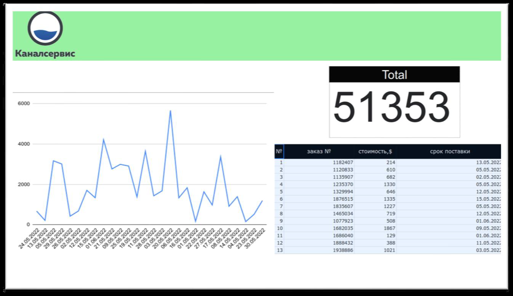

# *Краткая инструкция по запуску*

   - Добавьте в текущую директорию файл с ключом к Google Sheets API под именем credentials.json, либо укажите в файле настроек settings.py путь к файлу на Вашем компьютере.
   - Добавьте в файле настроек settings.py Ваш токен телеграмм бота и id чата, в который бот будет отправлять уведомления.
   - Находясь в текущей директории, введите команду в терминале: docker-compose up
   - По окончанию запуска контейнеров с базами данных, введите следующие команды в новых окнах терминала:
      - pip install -r requirements.txt
      - celery -A main.celery worker -l info 
         (для windows: celery -A main.celery worker -l info -P eventlet)
      - python main.py 
   
   > Веб интерфейс приложения будет доступен по адресу: http://127.0.0.1:5000/

Открыть описание технического задания:

# **Тестовое задание Python**

Необходимо разработать скрипт на языке Python 3, 

который будет выполнять следующие функции:

1. Получать данные с документа при помощи Google API, сделанного в [Google Sheets](https://docs.google.com/spreadsheets/d/1f-qZEX1k_3nj5cahOzntYAnvO4ignbyesVO7yuBdv_g/edit) (необходимо копировать в свой Google аккаунт и выдать самому себе права).
2. Данные должны добавляться в БД, в том же виде, что и в файле –источнике, с добавлением колонки «стоимость в руб.»
    
    a. Необходимо создать DB самостоятельно, СУБД на основе PostgreSQL.
    
    b. Данные для перевода $ в рубли необходимо получать по курсу [ЦБ РФ](https://www.cbr.ru/development/SXML/).
    
3. Скрипт работает постоянно для обеспечения обновления данных в онлайн режиме (необходимо учитывать, что строки в Google Sheets таблицу могут удаляться, добавляться и изменяться).

Дополнения, которые дадут дополнительные баллы и поднимут потенциальный уровень оплаты труда:

1. a. Упаковка решения в docker контейнер
    
    b. Разработка функционала проверки соблюдения «срока поставки» из таблицы. В случае, если срок прошел, скрипт отправляет уведомление в Telegram.
    
    c. Разработка одностраничного web-приложения на основе Django или Flask. Front-end React.
    
    
    

1. Решение на проверку передается в виде ссылки на проект на Github.
В описании необходимо указать ссылку на ваш Google Sheets документ (открыть права чтения и записи для пользователя [amkolotov@gmail.com](mailto:amkolotov@gmail.com)), а также инструкцию по запуску разработанных скриптов.

